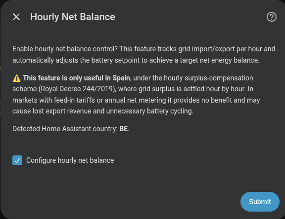

# Opciones avanzadas

Tras configurar la carga predictiva, el asistente ofrece cinco pasos opcionales adicionales que ajustan el comportamiento de la integración en situaciones específicas.

---

## Carga semanal completa

Fuerza una carga al **100 % una vez por semana** para equilibrar las celdas de la batería (cell balancing). Solo es necesario configurar el día de la semana.

| Campo | Descripción | Por defecto |
|---|---|---|
| **Día de la semana** | En este día la batería cargará al 100% para equilibrar las celdas | — |
| **Activar monitor de equilibrio de celdas** | Si está marcado, se activa el balanceo activo de celdas (puede ser *lento*) | Desactivado |

Ver [Carga semanal completa](../features/weekly-full-charge.md) para el detalle de funcionamiento.

{ width="650"  style="display: block; margin: 0 auto;"}

---

## Retraso de carga solar

Retrasa la carga matutina desde la red mientras la producción solar prevista pueda cubrir la energía necesaria.

| Campo | Descripción | Por defecto |
|---|---|---|
| **Margen de seguridad (h)** | Horas antes del atardecer en las que la carga debe haber terminado | 1 h |
| **Sensor de previsión solar** | Solo si no se configuró en el paso inicial | — |
| **Activar SOC mínimo antes del retraso** | Si está activado, la batería cargará hasta el SOC configurado antes de aplicar el retraso solar | Desactivado |
| **SOC mínimo (%)** | SOC de la batería a alcanzar antes de que se active el retraso de carga solar | — |

Un margen mayor (p. ej. 180 min) desbloquea la carga desde la red más temprano; un margen menor espera más tiempo a que el sol cubra la energía.

Ver [Retraso de carga solar](../features/solar-charge-delay.md) para el detalle de funcionamiento.

{ width="650"  style="display: block; margin: 0 auto;"}

---

## Protección de capacidad (peak shaving)

Limita la descarga cuando el SOC cae por debajo de un umbral, cubriendo solo los picos de consumo que superen un límite configurable.

| Campo | Descripción | Por defecto | Rango |
|---|---|---|---|
| **Umbral de SOC** | Por debajo de este % la protección se activa | `30 %` | `20-100 %` |
| **Límite de potencia de pico** | Consumo máximo que la batería cubre; el exceso va a la red | `2500 W` | `500-10000 W` |

Ver [Peak shaving](../features/peak-shaving.md) para el detalle de funcionamiento.

{ width="650"  style="display: block; margin: 0 auto;"}

---

## Balance neto horario

Registra la importación y exportación de red dentro de cada hora civil y ajusta el setpoint del controlador PD en tiempo real para llevar la energía neta hacia un objetivo configurable. El objetivo por defecto es 0 Wh — balance neto cero cada hora — pero puede desplazarse para permitir una importación fija o apuntar a una exportación fija.

| Campo | Descripción | Por defecto |
|---|---|---|
| **Objetivo de balance neto (kWh)** | Balance neto de energía objetivo (0=neto cero, positivo=importación neta, negativo=exportación neta) | `0 kWh` |
| **Offset máximo (W)** | Offset máximo de potencia que puede aplicar el controlador (suma de todas las baterías) | `1000 W` |
| **Tolerancia de balance neto (kWh)** | Banda de tolerancia alrededor del objetivo (0=sin corrección) | `0 kWh` |
| **Histéresis de offset (W)** | Cambio mínimo de offset antes de aplicar correcciones (0=aplicar cada ciclo) | `15 W` |

Ver [Balance neto horario](../features/hourly-net-balance.md) para el detalle de funcionamiento.

{ width="650"  style="display: block; margin: 0 auto;"}

{ width="650"  style="display: block; margin: 0 auto;"}

---

## Controlador PD avanzado

!!! warning "Solo para usuarios expertos"
    No modifiques estos valores salvo que entiendas la teoría de control PD y cómo interactúa con los tiempos de respuesta del inversor. **Los valores por defecto funcionan correctamente en la gran mayoría de instalaciones.**

Permite ajustar los parámetros internos del controlador PD. Todos los valores son modificables también en tiempo de ejecución desde las entidades de configuración de la integración, sin necesidad de reiniciar.

| Parámetro | Por defecto | Rango | Descripción |
|---|---|---|---|
| **Kp** | `0.65` | 0.1 – 2.0 | Ganancia proporcional. Mayor valor = respuesta más rápida pero más sobreoscilación |
| **Kd** | `0.5` | 0.0 – 2.0 | Ganancia derivativa. Mayor valor = transiciones más suaves pero respuesta más lenta |
| **Deadband** | `40 W` | 0 – 200 W | Zona muerta. El controlador no actúa si el error es menor que este valor |
| **Cambio máximo de potencia** | `800 W/ciclo` | 100 – 2000 W | Límite de variación por ciclo. Protege contra cambios bruscos |
| **Histéresis direccional** | `60 W` | 0 – 200 W | Margen necesario para cambiar de carga a descarga o viceversa |
| **Potencia mínima de carga** | `0 W` | 0 – 2000 W | Si el controlador calcula una carga por debajo de este valor, permanece en espera. `0` = desactivado |
| **Potencia mínima de descarga** | `0 W` | 0 – 2000 W | Igual que el anterior pero para descarga. `0` = desactivado |
| **Activar limites de potencia del sistema** | desactivado | activado/desactivado | Activa la funcionalidad de limite global de carga/descarga |
| **Potencia maxima de carga del sistema** | `0 W` | 0 – 15000 W | Limite opcional para la potencia de carga combinada de todas las baterias activas. `0` = desactivado |
| **Potencia maxima de descarga del sistema** | `0 W` | 0 – 15000 W | Limite opcional para la potencia de descarga combinada de todas las baterias activas. `0` = desactivado |

Los parámetros de potencia mínima de carga/descarga son útiles para evitar microciclos ineficientes cuando la demanda de la red es muy baja.

Los limites maximos del sistema son utiles cuando la instalacion tiene un limite compartido de hardware o cableado. No reducen el maximo individual de cada bateria: si solo una bateria esta activa, puede seguir usando su limite configurado; cuando hay varias baterias activas, el controlador limita el total combinado al cap configurado.

Cuando **Activar limites de potencia del sistema** esta desactivado, ambos caps se ignoran y no se crean sus entidades `number` de runtime. Cuando esta activado, los caps se exponen como sliders en el dispositivo Marstek Venus System.

{ width="650"  style="display: block; margin: 0 auto;"}
