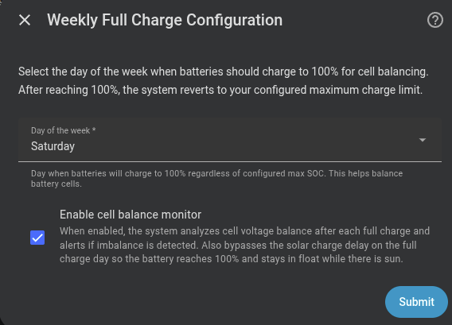
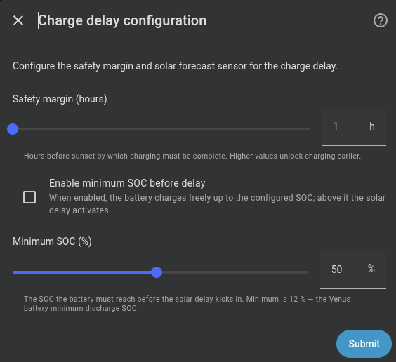
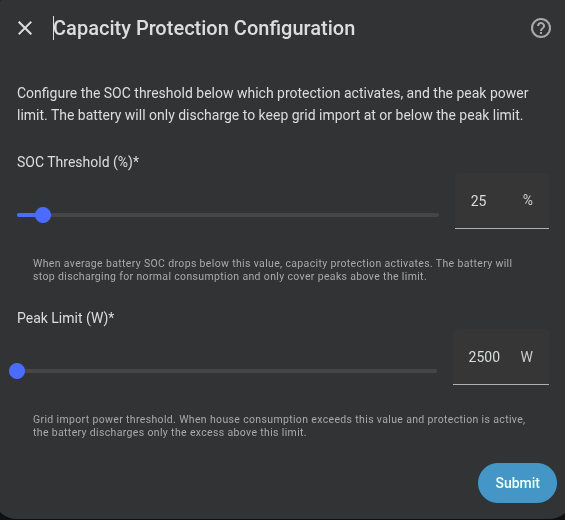
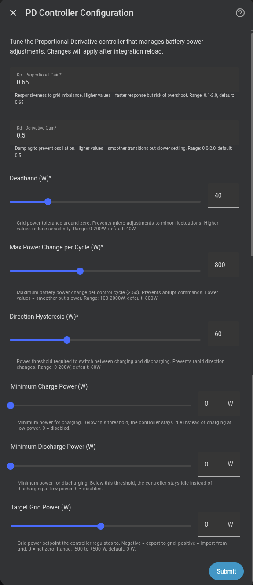

# Advanced options

After configuring predictive charging, the wizard offers four additional optional steps that adjust the integration's behaviour in specific situations.

---

## Weekly full charge

Forces a **100% charge once a week** for cell balancing. You only need to select the day of the week.

See [Weekly full charge](../features/weekly-full-charge.md) for how it works.

{ width="650"  style="display: block; margin: 0 auto;"}

---

## Solar charge delay

Delays morning grid charging while the expected solar production can cover the required energy.

| Field | Description | Default |
|---|---|---|
| **Safety margin** | Minutes before sunset by which charging must be complete | 60 min |
| **Solar forecast sensor** | Only if not configured in the initial setup step | — |

A larger margin (e.g. 180 min) unlocks grid charging earlier in the day; a smaller margin waits longer for the sun to cover the energy.

See [Solar charge delay](../features/solar-charge-delay.md) for how it works.

{ width="650"  style="display: block; margin: 0 auto;"}

---

## Capacity protection (peak shaving)

Limits discharge when SOC drops below a threshold, covering only consumption peaks that exceed a configurable power limit.

| Field | Description | Default |
|---|---|---|
| **SOC threshold** | Protection activates below this % | `30 %` |
| **Peak power limit** | Maximum consumption the battery covers; the excess falls to the grid | `2500 W` |

See [Peak shaving](../features/peak-shaving.md) for how it works.

{ width="650"  style="display: block; margin: 0 auto;"}

---

## Advanced PD controller

!!! warning "Expert users only"
    Do not modify these values unless you understand PD control theory and how it interacts with inverter response times. **Default values work correctly for the vast majority of installations.**

Allows tuning the internal PD controller parameters. All values can also be adjusted at runtime from the integration's configuration entities without restarting.

| Parameter | Default | Range | Description |
|---|---|---|---|
| **Kp** | `0.65` | 0.1 – 2.0 | Proportional gain. Higher = faster response but more overshoot |
| **Kd** | `0.5` | 0.0 – 2.0 | Derivative gain. Higher = smoother transitions but slower response |
| **Deadband** | `40 W` | 0 – 200 W | Dead zone. Controller does not act if the error is smaller than this value |
| **Max power change** | `800 W/cycle` | 100 – 2000 W | Maximum change per cycle. Protects against abrupt swings |
| **Direction hysteresis** | `60 W` | 0 – 200 W | Margin required to switch between charging and discharging |
| **Min charge power** | `0 W` | 0 – 2000 W | If the controller calculates charge below this value, it stays idle. `0` = disabled |
| **Min discharge power** | `0 W` | 0 – 2000 W | Same as above but for discharge. `0` = disabled |

The min charge/discharge power parameters are useful to prevent inefficient micro-cycling when grid demand is very low.

{ width="650"  style="display: block; margin: 0 auto;"}
