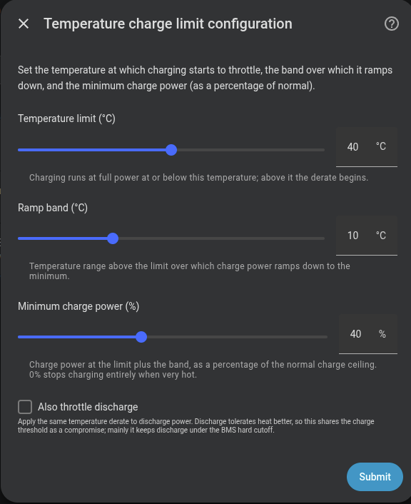

# Advanced options

After configuring predictive charging, the wizard offers five additional optional steps that adjust the integration's behaviour in specific situations.

---

## Weekly full charge

Forces a **100% charge once a week** for cell balancing. You only need to select the day of the week.

| Field | Description | Default |
|---|---|---|
| **Day of the week** | On this day the battery will charge to 100% for cell balancing | — |
| **Wait for solar charge delay** | If checked solar charge delay has priority (dashboard setting) | Disabled |

See [Weekly full charge](../features/weekly-full-charge.md) for how it works.

{ width="650"  style="display: block; margin: 0 auto;"}

---

## Solar charge delay

Delays morning grid charging while the expected solar production can cover the required energy.

| Field | Description | Default |
|---|---|---|
| **Safety margin (h)** | Hours before sunset by which charging must be complete | 1 h |
| **Solar forecast sensor** | Only if not configured in the initial setup step | — |
| **Enable minimum SOC before delay** | if enabled battery will charge to configured SOC before solar charge delay | Disabled |
| **Minimum SOC (%)** | Battery SOC to reach before solar charge delay kicks in | — |
| **Balance deadband (kWh)** | Tolerance on energy-balance check; if battery+solar forecast<expected consumption then delay is longer (dashboard setting) | `0.5 kWh` |

A larger margin (e.g. 180 min) unlocks grid charging earlier in the day; a smaller margin waits longer for the sun to cover the energy.

See [Solar charge delay](../features/solar-charge-delay.md) for how it works.

{ width="650"  style="display: block; margin: 0 auto;"}

---

## Temperature charge limit

Reduces charge/discharge power when the battery gets hot. Above a temperature limit charging/discharging is throttled proportionally and restored as the battery cools down.

Linear derate from full charge power down to a floor as a battery's temperature crosses a configurable limit and band; floor is clamped to each battery's minimum operating power (v2/v3 = 800 W, vA/vD/Zendure = 0). Optional discharge derate too, to stay under the BMS over-temp cutoff. Controls in all six languages. Thanks to @syphernl for the contribution.

| Field | Description | Default |
|---|---|---|
| **Temperature limit (°C)** | Charging runs at full power at or below this temperature; above the derate begins | `40°C` |
| **Ramp band (°C)** | Temperature range above the limit over which charge power ramps down to the minimum | `10°C` |
| **Minimum charge power (%)** | Charge power at the limit plus the band, as a percentage of the normal charge ceiling. 0% stops charging when very hot | `40%` |
| **Also throttle discharge** | Apply the same temperature derate to discharge power. Keeps discharge under the BMS over-temp cutoff. | `off`|

{ width="650"  style="display: block; margin: 0 auto;"}

---

## Capacity protection (peak shaving)

Limits discharge when SOC drops below a threshold, covering only consumption peaks that exceed a configurable power limit.

| Field | Description | Default | Range |
|---|---|---|---|
| **SOC threshold (%)** | Protection activates below this % | `30 %` | `20-100 %` |
| **Peak limit (W)** | Grid power threshold. The battery discharges the excess above this limit if capacity protection is active | `2500 W` | `500-10000 W` |

See [Peak shaving](../features/peak-shaving.md) for how it works.

{ width="650"  style="display: block; margin: 0 auto;"}

---

## Hourly net balance

Tracks grid import and export within each civil hour and adjusts the PD setpoint in real time to drive the net energy toward a configurable target. The default target is 0 Wh — net zero each hour — but you can shift it to allow a fixed import or target a fixed export.

| Field | Description | Default |
|---|---|---|
| **Target net balance (kWh)** | Target net energy balance  (0=net zero, positive=net import, negative=net export) | `0 kWh`|
| **Maximum offset (W)** | Maximum power offset the controller can apply (sum of all batteries) | `1000 W` |
| **Net balance tolerance (kWh)** | Tolerance band around target (0=no correction) | `0 kWh` |
| **Offset hysteresis (W)** | Minimum change in offset before corrections are applied (0=apply every cycle) | `15 W` |

See [Hourly net balance](../features/hourly-net-balance.md) for how it works.

{ width="650"  style="display: block; margin: 0 auto;"}

{ width="650"  style="display: block; margin: 0 auto;"}

---

## Advanced PD controller

!!! warning "Expert users only"
    Do not modify these values unless you understand PD control theory and how it interacts with inverter response times. **Default values work correctly for the vast majority of installations.**

Allows tuning the internal PD controller parameters. All values can also be adjusted at runtime from the integration's configuration entities without restarting.

!!! tip "Prefer profiles"
    Most users don't need to touch these by hand. The **PD tuning profile** selector applies vetted `Kp`/`Kd`/rate-limit presets in one click, and the **PD Control Quality** sensor shows whether the result is stable, oscillating or sluggish. See [PD controller → Tuning profiles](../features/pd-controller.md#tuning-profiles).

| Parameter | Default | Range | Description |
|---|---|---|---|
| **Kp** | `0.35` | 0.1 – 2.0 | Proportional gain. Higher = faster response but more overshoot |
| **Kd** | `0.3` | 0.0 – 2.0 | Derivative gain. Higher = smoother transitions but slower response |
| **Deadband** | `40 W` | 0 – 200 W | Dead zone. Controller does not act if the error is smaller than this value |
| **Max power change** | `800 W/cycle` | 100 – 2000 W | Maximum change per cycle. Protects against abrupt swings |
| **Direction hysteresis** | `60 W` | 0 – 200 W | Margin required to switch between charging and discharging |
| **Min charge power** | `0 W` | 0 – 2000 W | If the controller calculates charge below this value, it stays idle. `0` = disabled |
| **Min discharge power** | `0 W` | 0 – 2000 W | Same as above but for discharge. `0` = disabled |
| **Enable system power limits** | `off` | on/off | Enables the system-wide charge/discharge cap feature |
| **System max charge power** | `0 W` | 0 – 15000 W | Optional cap for the combined charge power of all active batteries. `0` = disabled |
| **System max discharge power** | `0 W` | 0 – 15000 W | Optional cap for the combined discharge power of all active batteries. `0` = disabled |

The min charge/discharge power parameters are useful to prevent inefficient micro-cycling when grid demand is very low.

The system max charge/discharge caps are useful when the installation has a shared hardware or wiring limit. They do not reduce each battery's individual maximum: if only one battery is active, it can still use its own configured limit; when several batteries are active, the controller throttles the combined total to the configured system cap.

When **Enable system power limits** is off, both caps are ignored and their runtime number entities are not created. When enabled, the caps are exposed as slider entities on the Omnibattery System device.

{ width="650"  style="display: block; margin: 0 auto;"}

!!! warning "No-PD Direct Tracking"
    You can bypass the PD controller by enabling this on the Control tab of your dashboard. Each battery will track the grid setpoint 1:1. There will be no integral/derivative/smoothing/rate-limit. It will use the deadband, min charge/discharge power, relay cooldown and target grid power.
    **Use only if PD tuning can't tame your meter, PD is the safer default !**

