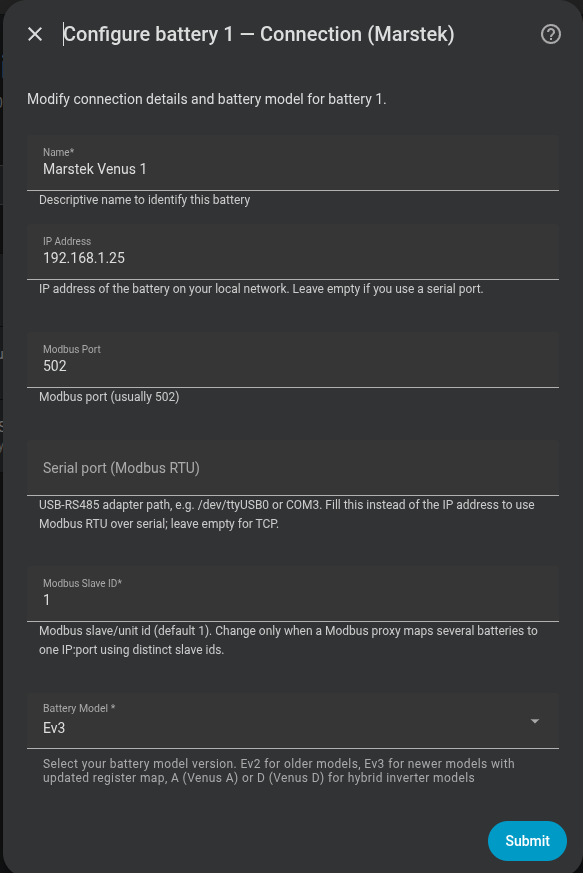
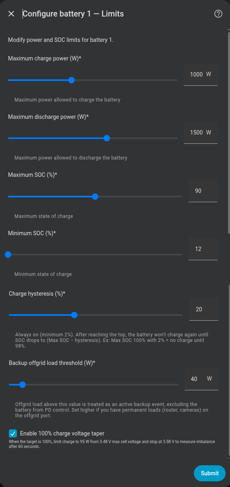

# Configuración de baterías

## Número de baterías

Selecciona cuántas unidades Marstek Venus tienes (1–6). La integración te pedirá configurar cada una por separado.

{ width="650"  style="display: block; margin: 0 auto;"}

---

## Parámetros por batería

| Parámetro | Descripción | Valor por defecto |
|---|---|---|
| **Nombre** | Nombre identificativo (p. ej. "Venus 1") | — |
| **Host** | IP del conversor Modbus TCP | — |
| **Puerto** | Puerto TCP Modbus | `502` |
| **Versión** | Modelo de la batería | — |
| **Potencia máx. carga/descarga** | Potencia nominal de la instalación | — |
| **SOC máximo** | Detiene la carga al alcanzar este % | `100 %` |
| **SOC mínimo** | Detiene la descarga al alcanzar este % | `12 %` |
| **Histéresis de carga** | Siempre activa (mínimo 2 %). Tras llegar al tope, la batería no vuelve a cargar hasta que el SOC baje este margen — evita ciclos rápidos y absorbe la deriva de la lectura de SOC | `2 %` |
| **Umbral offgrid backup** | Carga offgrid mínima (W) para considerarse un evento de backup activo | `50 W` |

### Versiones de batería

| Versión | Modelos |
|---|---|
| `v1/v2` | Venus E v1, Venus E v2 |
| `v3` | Venus E v3 |
| `vA` | Venus A |
| `vD` | Venus D |

!!! warning "Potencia máxima 2500 W"
    Usa el modo **2500 W** solo si tu instalación doméstica puede soportar esa potencia de forma segura.

{ width="650"  style="display: block; margin: 0 auto;"}
{ width="650"  style="display: block; margin: 0 auto;"}

---

## SOC y límites de potencia en tiempo de ejecución

Los valores de SOC máximo/mínimo y potencia máxima de carga/descarga se pueden ajustar en cualquier momento desde los sliders de la integración sin necesidad de reconfigurar. Los cambios se persisten y se restauran en cada reinicio de Home Assistant.

Si elevas el **SOC máximo** de una batería al `100 %`, esa batería usa protección superior por tensión: throttle de carga a 95 W desde `max_cell_voltage >= 3,48 V`, luego la carga se detiene a 3,58 V y la integración espera 60 s para registrar la medición de balance. La carga queda entonces parada (no vuelve a cargar a goteo ni fuerza descarga) hasta que el SOC baja un pequeño margen — así la celda se relaja desde la parte alta en vez de quedar clavada ahí. Consulta [Monitor de equilibrio de celdas](../features/cell-balance-monitor.md#reduccion-por-voltaje-al-100) para las condiciones exactas de entrada y salida.

{ width="650"  style="display: block; margin: 0 auto;"}

---

## Umbral offgrid backup en tiempo de ejecución

La entidad numérica **Umbral Offgrid Backup** (visible en la tarjeta de dispositivo de cada batería, entre las entidades de configuración) permite ajustar el umbral en cualquier momento sin entrar al flujo de opciones. Auméntalo si tu batería tiene cargas permanentes pequeñas en el puerto offgrid — como un switch PoE, router o cámaras IP — que de otro modo mantendrían la batería permanentemente excluida del control PD.

| Escenario | Umbral recomendado |
|---|---|
| Sin cargas permanentes en offgrid | `0 W` (cualquier carga activa la exclusión) |
| Cargas pequeñas (router + switch, ~20–40 W) | `50 W` (valor por defecto) |
| Cargas más pesadas (NAS, AP, cámaras, ~80–120 W) | `150 W` |

!!! tip "Cómo funciona"
    Cuando el switch **Función Backup** está activado y la carga offgrid medida supera el umbral, la batería queda excluida del control PD y se gestiona de forma autónoma. Se aplica un período de enfriamiento de 5 minutos tras bajar del umbral, para evitar enviar comandos inmediatamente después de que termine un evento de backup.
