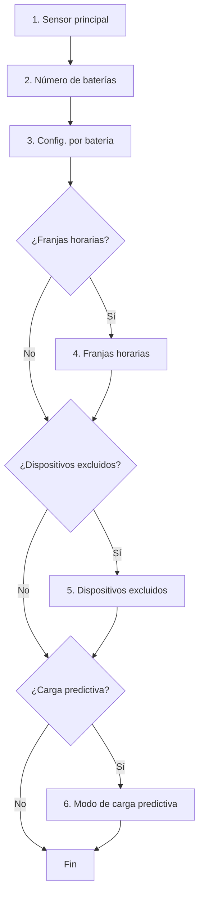
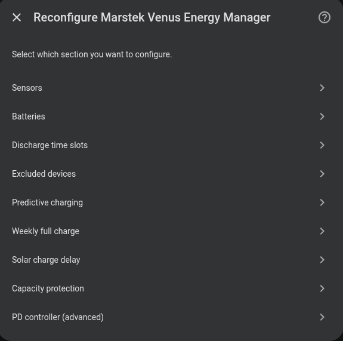

# Configuración

La integración se configura íntegramente desde la interfaz de Home Assistant mediante un asistente de varios pasos.

## Pasos del asistente

| Paso | Descripción | Obligatorio |
|------|-------------|:-----------:|
| [Sensor principal](main-sensor.md) | Sensor de consumo de red y sensor solar | ✅ |
| Baterías | Número de unidades y configuración por batería | ✅ |
| [Baterías](batteries.md) | IP, puerto, versión, límites de potencia y SOC | ✅ |
| [Franjas horarias](time-slots.md) | Ventanas de descarga con parámetros por franja | ❌ |
| [Dispositivos excluidos](excluded-devices.md) | Cargas pesadas a ignorar | ❌ |
| [Carga predictiva](predictive-charging/index.md) | Carga desde la red cuando la previsión solar es insuficiente | ❌ |
| [Opciones avanzadas](advanced.md) | Carga semanal, retraso solar, peak shaving | ❌ |

## Modificar la configuración

Una vez instalada, puedes modificar cualquier parámetro en:
**Ajustes → Dispositivos y servicios → Marstek Venus Energy Manager → Configurar**

{ width="650" style="display: block; margin: 0 auto;"}
