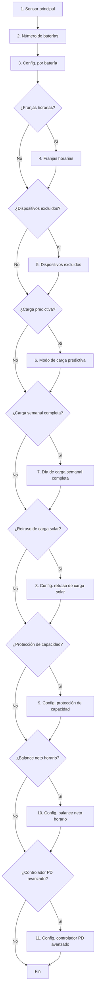

# Configuración

La integración se configura íntegramente desde la interfaz de Home Assistant mediante un asistente de varios pasos.

## Pasos del asistente

| Paso | Descripción | Obligatorio |
|------|-------------|:-----------:|
| [Sensor principal](main-sensor.md) | Sensor de consumo de red, sensor solar y sensor de consumo del hogar | ✅ |
| Baterías | Número de unidades | ✅ |
| [Baterías](batteries.md) | Config. por batería: nombre, IP, puerto, versión, límites de potencia y SOC | ✅ |
| [Franjas horarias](time-slots.md) | Ventanas de descarga/carga con parámetros por franja | ❌ |
| [Dispositivos excluidos](excluded-devices.md) | Cargas pesadas a ignorar | ❌ |
| [Carga predictiva](predictive-charging/index.md) | Carga desde la red cuando la previsión solar es insuficiente | ❌ |
| [Carga semanal completa](advanced.md) | Carga las baterías al 100% una vez a la semana para equilibrar las celdas | ❌ |
| [Retraso de carga solar](advanced.md) | Evita cargar las baterías por la mañana si la producción solar prevista será suficiente | ❌ |
| [Protección de capacidad](advanced.md) | Reserva una parte de la capacidad de batería para picos de demanda (peak shaving) | ❌ |
| [Balance neto horario](advanced.md) | Establece el balance neto de importación/exportación horario a un objetivo específico (por defecto 0 Wh) | ❌ |
| [Controlador PD (avanzado)](advanced.md) | Ajuste fino del controlador PD para mantener el flujo de red en el objetivo configurado | ❌ |

## Modificar la configuración

Una vez instalada, puedes modificar cualquier parámetro en:
**Ajustes → Dispositivos y servicios → Marstek Venus Energy Manager → Configurar**

{ width="650" style="display: block; margin: 0 auto;"}
