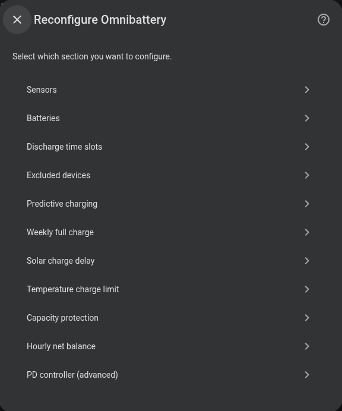

# Configuration

The integration is configured entirely from the Home Assistant UI through a multi-step wizard.

## Wizard steps

```mermaid
flowchart TD
    A[1. Main sensor config] --> B[2. Number of batteries]
    B --> C[3. Per-battery config]
    C --> D{Time slots?}
    D -- Yes --> E[4. Time slots config]
    D -- No --> F
    E --> F{Excluded devices?}
    F -- Yes --> G[5. Excluded devices config]
    F -- No --> H
    G --> H{Predictive charging?}
    H -- Yes --> I[6. Predictive charging mode config]
    H -- No --> J
    I --> J{Weekly full charge?}
    J -- Yes --> K[7. Weekly full charge day]
    J -- No --> L
    K --> L{Solar charge delay?}
    L -- Yes --> M[8. Solar charge delay config]
    L -- No --> N
    M --> N{Temperature charge limit?}
    N -- Yes --> O[9. Temperature charge limit]
    N -- No --> P  
    O --> P{Capacity protection?}
    P -- Yes --> Q[10. Capacity protection config]
    P -- No --> R
    Q --> R{Hourly net balance?}
    R -- Yes --> S[11. Hourly net balance config]
    R -- No --> T
    S --> T{PD controller advanced?}
    T -- Yes --> U[12. PD controller advanced config]
    T -- No --> W
    U --> W[Done]
```

| Step | Description | Required |
|------|-------------|:--------:|
| [Main sensor](main-sensor.md) | Grid consumption sensor and solar sensor (home consumption is derived) | ✅ |
| Batteries | Number of battery units | ✅ |
| [Batteries](batteries.md) | Per-battery config : name, IP, port, version, power limits and SOC | ✅ |
| [Time slots](time-slots.md) | Discharge/charge windows with per-slot parameters | ❌ |
| [Excluded devices](excluded-devices.md) | Heavy loads to ignore | ❌ |
| [Predictive charging](predictive-charging/index.md) | Grid charging when solar forecast is insufficient | ❌ |
| [Weekly full charge](advanced.md) | Charge batteries to 100% once a week to balance the cells | ❌ |
| [Solar charge delay](advanced.md) | Avoid to charge the batteries early if expected solar production will suffice | ❌ |
| [Temperature charge limit](advanced.md) | Linear derate charge/discharge power based on battery temperature | ❌ |
| [Capacity protection](advanced.md) | Reserves a portion of battery capacity for demand spikes (peak shaving) | ❌ |
| [Hourly net balance](advanced.md) | Sets the hourly net import/export energy to a specific target (default 0 Wh) | ❌ |
| [PD controller (advanced)](advanced.md) | Finetune the PD controller to keep the grid flow to the configured target | ❌ |

## Modifying the configuration

Once installed, any parameter can be changed at:
**Settings → Devices & Services → Omnibattery → Configure**

{ width="650" style="display: block; margin: 0 auto;"}
