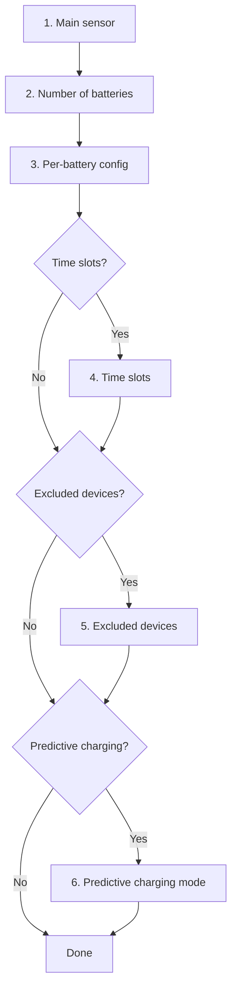

# Configuration

The integration is configured entirely from the Home Assistant UI through a multi-step wizard.

## Wizard steps

| Step | Description | Required |
|------|-------------|:--------:|
| [Main sensor](main-sensor.md) | Grid consumption sensor and solar sensor | ✅ |
| Batteries | Number of units and per-battery configuration | ✅ |
| [Batteries](batteries.md) | IP, port, version, power limits and SOC | ✅ |
| [Time slots](time-slots.md) | Discharge windows with per-slot parameters | ❌ |
| [Excluded devices](excluded-devices.md) | Heavy loads to ignore | ❌ |
| [Predictive charging](predictive-charging/index.md) | Grid charging when solar forecast is insufficient | ❌ |
| [Advanced options](advanced.md) | Weekly charge, solar delay, peak shaving | ❌ |

## Modifying the configuration

Once installed, any parameter can be changed at:
**Settings → Devices & Services → Marstek Venus Energy Manager → Configure**

{ width="650" style="display: block; margin: 0 auto;"}
