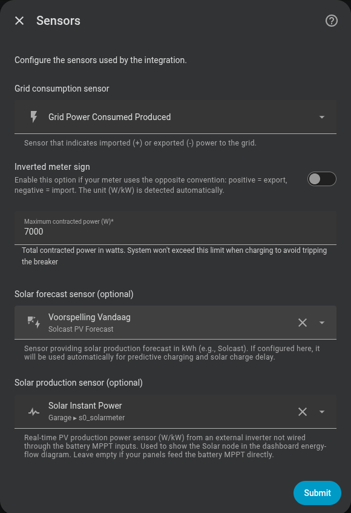

# Sensor principal

El primer paso configura las fuentes de datos globales de la integración.

## Sensor de consumo de red

Sensor de Home Assistant que mide el intercambio de potencia con la red (en **W** o **kW**).

!!! tip "Sensores compatibles"
    Cualquier sensor que exponga la potencia de red funciona: Shelly EM, Shelly EM3, Neurio, integraciones de contador inteligente (e.g. `sensor.grid_power`).

!!! warning "Frecuencia de actualización"
    El sensor debe actualizarse lo más rápido posible. El controlador es **dirigido por eventos** —recalcula cada vez que este sensor publica un valor nuevo—, así que la frecuencia de actualización del sensor *es* la frecuencia de control: un sensor más rápido implica una respuesta más rápida y precisa. (Un watchdog de 2 segundos sigue ejecutando el ciclo si el sensor se queda en silencio.)

    El consumo del hogar puede variar varios kilovatios en fracciones de segundo (arranque de electrodomésticos, horno, lavadora…). Un sensor que reporta cada 10 segundos o más introduce un desfase que hace que el controlador reaccione a una situación que ya no existe, provocando sobreoscilaciones o correcciones innecesarias.

    **Recomendado: actualización cada 1–2 segundos.** Los dispositivos como Shelly EM/EM3 soportan este intervalo de forma nativa.

### Detección automática de kW

Si el atributo `unit_of_measurement` del sensor es `kW`, la integración multiplica el valor por 1000 automáticamente.

### Signo invertido

Activa **"Signo del medidor invertido"** si tu sensor usa la convención opuesta:

| Convención | Importación | Exportación |
|---|---|---|
| Estándar (por defecto) | Valor positivo | Valor negativo |
| Invertida | Valor negativo | Valor positivo |

Déjalo desactivado si no estás seguro.

---

## Sensor de previsión solar *(opcional)*

Sensor que proporciona la producción solar estimada para hoy, en **kWh** o **Wh**.

Configurarlo aquí lo pone a disposición de:

- **Carga predictiva** (modos Franja Horaria y Precio Dinámico)
- **Retraso de carga solar**

También puedes dejarlo en blanco y configurarlo más tarde en esas secciones específicas.

---

## Sensor de consumo del hogar *(opcional)*

Sensor de potencia (W o kW) que mide el consumo eléctrico total del hogar.

Este sensor es **opcional y actúa como override de precisión**. Por defecto la integración ya deriva el consumo del hogar de los valores que tiene (`red + AC de baterías + solar`), así que la carga predictiva y el retraso de carga funcionan sin él. Configurar un sensor dedicado solo reemplaza el valor derivado por una lectura directa.

**Cuándo configurarlo:**

- Tienes un pinzímetro, Shelly EM u otro dispositivo que mide la carga total del hogar.
- Quieres una medición directa en lugar de la derivada (p. ej. tus sensores de red/solar son ruidosos).

**Cómo funciona:**

| Modo | Fuente de consumo |
|------|------------------|
| Sensor configurado | Integración del sensor de potencia (W→kWh) durante la franja solar+batería |
| Sin sensor (por defecto) | Consumo del hogar derivado: `red + AC de baterías + solar` (mismo valor que el sensor Consumo de la Casa) |

En ambos modos la integración acumula energía únicamente durante la franja solar+batería (fuera de la franja de carga configurada). Si no hay franja configurada, acumula durante todo el día. El contador se reinicia a medianoche y sobrevive reinicios de HA.

El consumo diario resultante alimenta el mismo historial que leen la carga predictiva y el retraso de carga solar — no es necesaria ninguna configuración adicional en esas secciones.

!!! tip "Unidades admitidas"
    Se aceptan sensores en **W** y en **kW**. La integración lee el atributo `unit_of_measurement` y convierte automáticamente.

### Crear un sensor helper

!!! note
    La integración ya deriva el consumo del hogar con este mismo balance, así que un sensor helper **no es necesario**. Créalo solo si quieres una entidad independiente o una medición de hardware directa que sustituya al valor derivado.

El consumo del hogar es el balance de todos los flujos de potencia:

**Consumo del hogar = Potencia de red + Producción solar + Descarga batería − Carga batería**

Sin el término de batería, cuando carga estaríamos infracalculando el consumo y cuando descarga lo estaríamos sobreestimando.

Si tu contador y la batería exponen estos valores como sensores separados, combínalos mediante un **helper de plantilla** en Home Assistant.

**Ir a:** Configuración → Dispositivos y servicios → Helpers → Crear helper → Plantilla → Sensor de plantilla

```jinja




{{ (potencia_red + potencia_solar + descarga_bateria - carga_bateria) | round(0) }}
```

| Variable | Descripción | Ejemplo de entidad |
|---|---|---|
| `potencia_red` | Intercambio con la red (positivo = importar, negativo = exportar) | `sensor.shellypro3em_energy_meter_2_power` |
| `potencia_solar` | Producción solar total | `sensor.shellypro3em_energy_meter_1_power` |
| `descarga_bateria` | Potencia de descarga de la batería (positivo, W) | `sensor.marstek_venus_system_potencia_de_descarga_del_sistema` |
| `carga_bateria` | Potencia de carga de la batería (positivo, W) | `sensor.marstek_venus_system_potencia_de_carga_del_sistema` |

Establece la **unidad de medida** como `W` y la **clase de dispositivo** como `power`.

!!! tip "Varias ramas solares"
    Si tienes más de un inversor o string solar y no dispones de un sensor agregado único, súmalos:
    ```jinja
    
    ```

{ width="600"  style="display: block; margin: 0 auto;"}