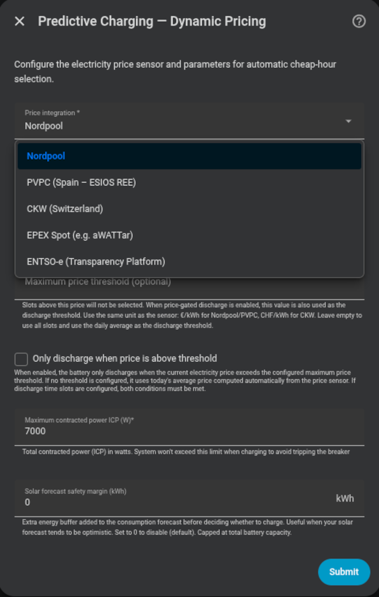

# Carga predictiva — Modo Precio Dinámico

Selecciona automáticamente las **horas más baratas del día** para cubrir el déficit energético calculado.

## Integraciones de precio compatibles

- **Nord Pool** — tanto la integración oficial de Home Assistant como la integración de HACS
- **PVPC** (ESIOS REE, España)
- **CKW** (Suiza)
- **EPEX Spot** (p. ej. aWATTar)
- **ENTSO-e** (Plataforma de Transparencia)
- **Tibber** — no necesita sensor de precio; el motor llama directamente al servicio `tibber.get_prices` (ver abajo)

!!! note "Tibber no necesita sensor"
    Al elegir **Tibber** como integración de precios, el campo *Sensor de precio* queda sin usar — el motor llama al servicio `tibber.get_prices` (precios de hoy y, tras las ~13:00, los de mañana), cachea los slots y refresca cada hora. La integración oficial de Tibber debe estar configurada en HA.

!!! note "Nord Pool oficial y HACS se configuran igual"
    Selecciona **Nordpool** y elige una entidad de precios del proveedor. Los sensores de HACS se siguen leyendo desde sus atributos `raw_today` / `raw_tomorrow`. Si la entidad pertenece a la integración oficial de Nord Pool de Home Assistant, Omnibattery resuelve automáticamente su área de mercado, llama a `nordpool.get_prices_for_date` para el día actual, convierte los valores de moneda/MWh a moneda/kWh y refresca la caché cada hora. No hace falta elegir otro proveedor ni crear un sensor de plantilla.

## Configuración

| Campo | Descripción |
|---|---|
| **Tipo de integración de precios** | Nordpool / PVPC / CKW / EPEX Spot / ENTSO-e / Tibber |
| **Sensor de precio** | Entidad de precios de HA. Para Nord Pool, selecciona una entidad oficial o el sensor existente de HACS; Tibber no usa este campo |
| **Umbral máximo de precio** | (Opcional) Precio techo; no carga aunque la hora sea "barata" si supera este valor. También se usa como umbral de descarga cuando el control de descarga por precio está activado |
| **Descargar solo cuando el precio supere el umbral** | (Opcional) Descarga condicionada al precio actual — ver abajo |
| **Suelo de precio de descarga (€)** | (Opcional) Suelo separado para la descarga condicionada — abre una banda de reposo entre el techo de carga y este suelo. Vacío = reutiliza el umbral máximo para ambos. Ver [Suelo de precio de descarga separado](#suelo-de-precio-de-descarga-separado) |
| **Margen de seguridad de previsión solar (kWh)** | (Opcional) Buffer de energía adicional añadido a la previsión de consumo antes de decidir si cargar (por defecto 0 kWh) |
| **Margen de carga de red predictiva (%)** | (Opcional) Aumenta la cantidad de carga de red para cubrir previsiones solares optimistas — p. ej. una necesidad de 2 kWh de red al 50 % carga 3 kWh. Limitado al hueco hasta el SOC máximo (por defecto 0 %) |

{ width="650"  style="display: block; margin: 0 auto;"}

## Evaluación diaria (00:05)

A las 00:05 el controlador:

1. Calcula el déficit energético (batería + solar vs. consumo esperado).
2. Recupera los precios horarios del día de la integración configurada.
3. Selecciona las horas más baratas necesarias para cubrir el déficit.
4. Calcula y almacena el **precio medio del día** a partir del perfil horario de precios.
5. Programa los slots de carga para el día.

### Lógica de reintentos

Si los datos de precios no están disponibles a las 00:05, el sistema reintenta cada 15 minutos durante la primera hora.

### Reinicio de HA a mitad del día

Si HA se reinicia después de la ventana de las 00:05 sin evaluación previa, el controlador lanza una evaluación automática en el arranque (tras 15 segundos) considerando solo los slots del día actual.

---

## Control de descarga por precio

La opción **"Descargar solo cuando el precio supere el umbral"** añade una condición adicional al comportamiento de descarga.

Cuando está activa, en **cada ciclo del controlador (dirigido por eventos)** se evalúa si el precio actual permite la descarga:

```
Si precio_actual > umbral:
    → Descarga permitida (el controlador PD opera con normalidad)
Si precio_actual <= umbral:
    → Descarga BLOQUEADA (la batería se mantiene en espera)
```

El umbral se resuelve así:

1. Si **Umbral máximo de precio** está configurado, se usa ese valor.
2. Si **Umbral máximo de precio** está vacío, se usa el precio medio diario.

El precio medio del día se calcula automáticamente durante la evaluación de las 00:05 a partir del perfil horario de precios. El objetivo es preservar la batería para las horas más caras del día. Si no hay umbral fijo configurado y la media diaria aún no está disponible, el control de descarga no actúa.

### Suelo de precio de descarga separado

Por defecto un único umbral controla ambos extremos: la batería carga desde la red solo **por debajo** del umbral máximo de precio y descarga solo **por encima**. El **Suelo de precio de descarga** opcional desacopla los dos fijando un suelo de descarga más bajo, abriendo una **banda de reposo** entre ellos:

```
precio ≥ umbral máximo de precio        → descarga permitida
suelo < precio < techo                  → reposo (sin carga de red, sin descarga)
precio ≤ suelo de precio de descarga    → descarga BLOQUEADA
```

En la banda de reposo la batería no carga desde red ni descarga — pero la **carga con excedente solar sigue funcionando**. Así se evita ciclar la batería por la diferencia marginal de precio en torno a la media. El suelo debe estar **igual o por encima** del techo de carga (se valida al guardar); déjalo vacío para reutilizar el umbral máximo para ambos (el comportamiento de umbral único de arriba).

Ambos umbrales se exponen además como entidades `number` en vivo (**Umbral Máximo de Precio** y **Suelo de Precio de Descarga**) para que las automatizaciones puedan reescribirlos sin entrar al flujo de opciones.

### Interacción con franjas horarias

Si las franjas horarias están configuradas para restringir la descarga, **ambas condiciones deben cumplirse** para que la batería descargue:

```
Descarga permitida = dentro_de_franja_horaria_de_descarga AND precio_actual > umbral
```

Fuera de una franja que permita la descarga, la batería nunca descarga. Dentro de ella, solo descarga si el precio es suficientemente alto.

### Efecto en el controlador PD

Cuando la descarga está bloqueada por precio, el controlador congela completamente su estado (potencia a 0, sin actualización del término derivativo), igual que ocurre durante una restricción de franja horaria. La batería se reactiva sin perturbaciones en cuanto el precio vuelve a superar el umbral activo.

---

## Atributos de diagnóstico

El sensor binario `predictive_charging_active` expone:

| Atributo | Descripción |
|---|---|
| `charging_needed` | Si se necesita carga según el balance |
| `selected_hours` | Horas seleccionadas con sus precios individuales |
| `average_price` | Precio medio de las horas seleccionadas |
| `estimated_cost` | Coste estimado de la carga |
| `evaluation_timestamp` | Cuándo se realizó la última evaluación |
| `price_data_status` | Estado del sensor de precios (`ok (N slots)`, `sensor_unavailable`, `no_slots`, `not_evaluated`) |

{ width="650"  style="display: block; margin: 0 auto;"}
