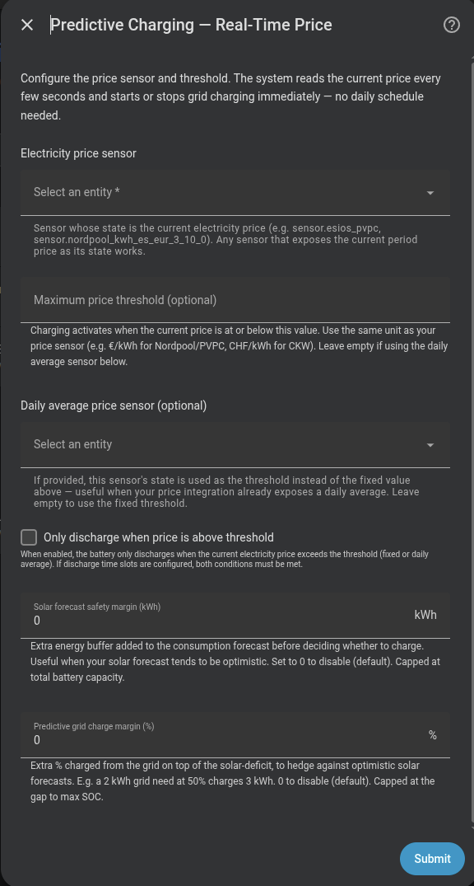

# Predictive charging — Real-Time Price mode

Activates or deactivates grid charging every controller cycle (event-driven) based on the **current electricity price**.

Unlike Dynamic Pricing mode, it requires no price forecast and no overnight evaluation. It reacts purely to the live price.

## Configuration

| Field | Description |
|---|---|
| **Electricity price sensor** | Any HA sensor with the current period price (PVPC, Nordpool, CKW…) |
| **Maximum price threshold (€)** | (Optional) Price below which grid charging activates |
| **Daily average price sensor** | (Optional) Dynamic threshold instead of a fixed value |
| **Only discharge when price exceeds threshold** | (Optional) Price-gated discharge — see below |
| **Maximum contracted power ICP (W)** | Maximum power when charging to avoid tripping the breaker (default 7000 W) |
| **Solar forecast safety margin (kWh)** | Extra energy buffer added to the consumption forecast before deciding whether to charge (default 0 kWh) |
| **Predictive grid charge margin (%)** | Tops up the grid-charge amount to hedge optimistic solar forecasts — e.g. a 2 kWh grid need at 50 % charges 3 kWh. Capped at the gap to max SOC (default 0 %) |

{ width="650"  style="display: block; margin: 0 auto;"}

## Charging behaviour

Every cycle (event-driven) the controller evaluates whether to start or stop grid charging:

```
If current_price ≤ threshold:
    And if (battery + solar) < expected_consumption:
        → Activate grid charging
If current_price > threshold:
    → Deactivate grid charging
```

The energy balance (battery + solar vs. expected consumption) is evaluated before starting charging, the same as in other modes.

### Threshold resolution

The threshold is resolved in this priority order:

1. **Daily average price sensor** — if configured and available, its value is the dynamic threshold.
2. **Maximum price threshold** — static numeric value configured in the setup flow.

If neither is available, the mode does not act.

---

## Price-based discharge control

The **"Only discharge when price exceeds threshold"** option adds an extra condition to discharge behaviour, independent of charging.

When active, **every controller cycle (event-driven)** checks whether the current price justifies discharge using the same threshold as for charging:

```
If current_price > threshold:
    → Discharge allowed (PD controller operates normally)
If current_price ≤ threshold:
    → Discharge BLOCKED (battery holds)
```

The inverse logic of charging: charge when price is low, discharge when price is high.

### Interaction with time slots

If discharge time slots are configured, **both conditions must be met**:

```
Discharge allowed = within_time_slot AND current_price > threshold
```

### Effect on the PD controller

When discharge is blocked by price, the controller completely freezes its state (power to 0, no derivative term update), the same as during a time slot restriction. The battery resumes smoothly as soon as the price exceeds the threshold.

---

## Differences from Dynamic Pricing

| Feature | Dynamic Pricing | Real-Time Price |
|---|---|---|
| Price forecast required | ✅ | ❌ |
| Overnight evaluation (00:05) | ✅ | ❌ |
| Reacts to live price | ❌ | ✅ |
| Optimal hour selection | ✅ | ❌ |
| Discharge threshold | Daily average (calculated at 00:05) | Configurable threshold (fixed or dynamic sensor) |
