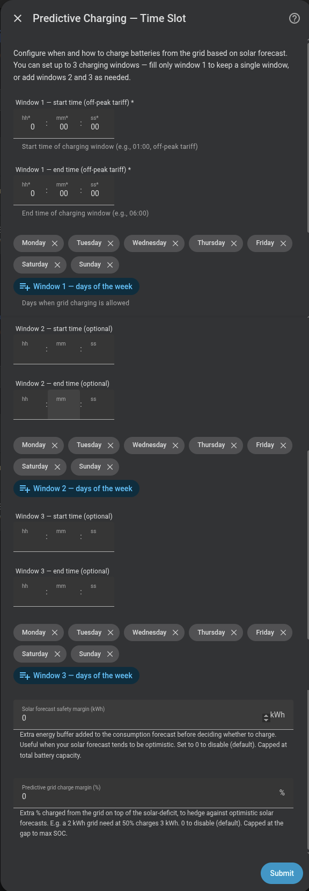

# Predictive charging — Time Slot mode

Charges from the grid during a **fixed time window** (typically cheap overnight tariff).

## Configuration

| Field | Description |
|---|---|
| **Charging window 1** | Start and end of the first charging slot (e.g. `02:00` – `05:00`), plus the days of the week it applies |
| **Charging windows 2 & 3** | (Optional) Up to two more windows, each with its own start/end and days |
| **Solar forecast sensor** | Current-day production sensor in kWh (optional) |
| **Solar forecast safety margin (kWh)** | Extra energy buffer added to consumption forecast before deciding whether to charge (default 0 kWh) |
| **Predictive grid charge margin (%)** | Extra % charged from the grid on top of the solar deficit (default 0%) |

!!! note "Up to 3 windows"
    You can configure 1, 2 or 3 charging windows — useful for a split tariff with both a night and a midday off-peak block. Fill only window 1 for the previous single-window behaviour; each extra window needs **both** a start and an end time (fill both or leave both empty). The consumption-window math treats the union of all configured windows.

!!! danger "Breaking change in v1.6.0"
    The solar forecast sensor field must now point to the **today** sensor (e.g. `sensor.solcast_pv_forecast_forecast_today`), not the tomorrow sensor.

!!! note "No solar sensor"
    If you have no solar panels, leave the forecast sensor empty. The system will charge whenever battery energy is insufficient to cover expected consumption.

{ width="650"  style="display: block; margin: 0 auto;"}

## Evaluation flow

1. **On slot entry**: batteries are held idle for 5 minutes to allow the solar forecast sensor time to update (particularly relevant when the slot starts at 00:00).
2. **5 minutes in**: the system evaluates the energy balance (`usable energy + solar forecast` vs. `estimated daily consumption`) and decides whether to charge.
3. A notification is sent with the decision.
4. Charging continues until the battery reaches the calculated level or the window ends.

## SOC-drop re-evaluation

If the SOC drops 30 % or more from the last evaluation point during the slot (e.g. due to high consumption), the system automatically re-evaluates the energy balance. No additional notification is sent for these mid-slot re-evaluations.
