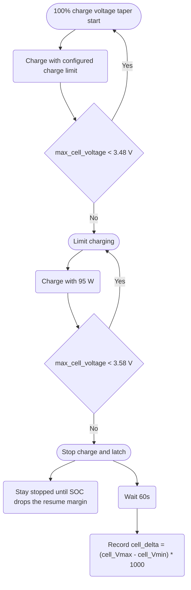
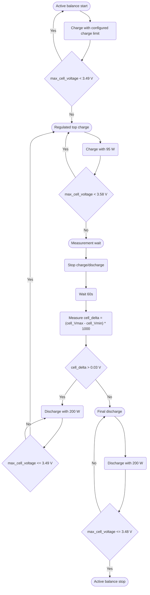

# Cell balance monitor

Tracks the voltage spread between the highest and lowest cell at the top of a full charge. The reading is used to show whether the battery pack is staying balanced over time and to trigger imbalance alerts when the spread becomes high.

## Why this is needed on LFP batteries

Marstek Venus batteries use LFP cells. LFP is very stable and long-lived, but its voltage curve is almost flat through most of the usable SOC range. Around the middle of the charge, two cells can have noticeably different SOC while still reporting almost the same voltage. That makes mid-SOC voltage readings poor indicators of cell balance.

The useful balance window is near the top of charge. Above roughly 3.45 V per cell, the LFP voltage curve rises much faster, so differences between cells become visible. That is also the area where the battery BMS is expected to perform passive balancing by bleeding the highest cells.

In practice, the Marstek BMS does not always balance the cells well by itself. If the pack reaches 100% quickly and then immediately returns to normal operation, weak balancing can leave one cell consistently higher than the rest. This integration therefore does two things:

- it slows the final part of a 100% charge so the BMS has time to work in the top-balance window;
- it measures imbalance only at a repeatable top-voltage point, instead of using noisy mid-SOC readings.

## The LFP charge curve in detail

LFP (LiFePO4) chemistry has a charge/discharge curve that is fundamentally different from Li-ion NMC or NCA. Understanding it is what justifies every voltage threshold this integration uses.

A typical 3.2 V nominal LFP cell behaves like this during a constant-current charge:

| SOC range | Cell voltage range | Slope |
|---|---|---|
| 0 – 10 % | 2.50 V → 3.20 V | Steep entry knee |
| 10 – 90 % | 3.20 V → 3.30 V | Almost flat — about 1 mV per % SOC |
| 90 – 97 % | 3.30 V → 3.45 V | Mild rise begins |
| 97 – 99 % | 3.45 V → 3.55 V | Knee — voltage starts climbing sharply |
| 99 – 100 % | 3.55 V → 3.65 V | Steep top knee — full-charge cliff |

That long flat plateau is the reason LFP voltage tells you almost nothing about state of charge in the middle of the curve. Two cells that look identical at 3.28 V can in reality have 5 – 10 % SOC of difference between them, which is huge.

The plateau also means **the BMS cannot do meaningful passive balancing in the middle of the curve**. Passive balancing works by bleeding current off the highest cell through a resistor. To even detect which cell is "highest", the BMS needs the spread between cells to rise above measurement noise. On the plateau, all cells read essentially the same number, so the BMS has nothing to act on.

Only when the pack enters the upper knee (above roughly 3.45 V) do cell voltages spread apart enough for the BMS to identify the leader. A 10 mV spread on the plateau might correspond to a 5 % SOC difference, but the same 10 mV spread above 3.50 V represents a tiny SOC delta — which is exactly what you want at the end of charge.

So balancing on LFP is only effective in a narrow window: roughly the last 1 – 3 % of charge, above 3.45 V. Outside that window the BMS is essentially blind to imbalance, and any time the pack spends below the knee is time the cells are *not* getting balanced.

## Availability

The cell balance monitor is always active. There is no separate configuration option because the readings are useful battery health data and do not change normal operation by themselves.

There are two related controls that decide when the battery is taken to the top-voltage measurement window:

- **100% charge voltage taper**: per battery option. When the charge target is 100%, the integration slows the final charge and records a top-voltage balance reading.
- **Active balance mode**: per battery switch. When enabled, the integration actively cycles that battery at the top until the measured cell delta is low enough.

The weekly full charge feature can temporarily set the battery max SOC to 100%. Once it does that, the same 100% charge voltage taper rules are used.

## 100% charge voltage taper

This path is used whenever the **100% charge voltage taper** option is enabled for a battery (and active balance mode is not running). It is voltage-driven: it engages once `max_cell_voltage` reaches the thresholds below, regardless of the configured `max_soc`. In practice that happens when:

- the user configured that battery with `max_soc = 100`, or
- the weekly full charge temporarily raised the battery to 100%, or
- a high `max_soc` below 100% still lets the cells reach 3.48 V.

The weekly full charge does not use a different balance profile. It only changes the target SOC to 100%; voltage thresholds, charge power and measurement logic are the same.

### Charge profile

    
| Condition for one battery | Action |
|---|---|
| `max_cell_voltage` below 3.48 V | Normal configured charge limit |
| `max_cell_voltage` at or above 3.48 V | Limit charge to 95 W |
| `max_cell_voltage` reaches 3.58 V | Stop charging and **latch**; do not re-trickle when the cell relaxes |
| SOC falls the resume margin (3%) below the latch SOC | Release the latch; normal charge logic applies again |
| After the 60 s wait | Record `delta_mV = (Vmax - Vmin) * 1000` |

Starting the taper is voltage based: SOC is deliberately not used to decide when tapering begins, because SOC can be less reliable near the top than the cell-voltage registers.

Once the battery reaches 3.58 V the taper stops charging and **latches off**. It does *not* re-trickle when the cell voltage relaxes — re-pausing every cycle would pin the cell at the top voltage and can keep some v3 BMSs from leaving standby to discharge. The latch releases — letting a later top-up taper again — only after SOC has dropped a small margin (default 3%, `NORMAL_BALANCE_RESUME_SOC_DROP`) below the SOC at which it latched, i.e. the battery was actually discharged. The 60-second delta-V measurement still runs as a best-effort diagnostic; if it did not finish before completion, a one-shot snapshot is captured at completion time under phase `top_charge_taper_complete`.

In a multi-battery system, this is evaluated per battery. One battery can be limited or paused while another continues charging normally.

### SOC recalibration on a stuck top voltage

Some packs reach the 3.58 V pause point while the BMS still reports a SOC well below full (for example 60–70%). That gap is a sign the BMS coulomb counter has drifted: the cells are genuinely full but the reported SOC is wrong.

When this happens, holding at 3.58 V never lets the BMS correct itself. So instead of pausing, the integration keeps charging at the 95 W tapered power until the BMS itself cuts off, *attempting* to make it recalibrate SOC to 100%.

This is a best-effort attempt, not a guaranteed fix. Whether a top-of-curve cutoff actually resets the reported SOC depends on the BMS firmware: some packs snap to 100% on an over-voltage cutoff, others do not. The integration only creates the conditions for a recalibration — it cannot force the BMS to apply one.

The override triggers automatically whenever **all** of these are true:

- the 100% voltage taper is active (so `max_cell_voltage` is in the top zone), and
- `max_cell_voltage` has reached the 3.58 V pause point, and
- the BMS still reports SOC below 99%.

It is self-limiting:

- charging continues at 95 W only (the gentle taper power), not full power;
- a BMS cutoff is detected when battery power collapses to ≤ 10 W and the inverter reports Standby for 5 consecutive cycles (~10 s). At that point the override latches off and the normal 3.58 V pause resumes, letting the SOC recalibrate;
- once the SOC reads 99% or more (after recalibration), the condition no longer matches, so the override does not fire again;
- the latch only re-arms after the battery leaves the top zone (`max_cell_voltage` below 3.48 V), so a later full charge can recalibrate again if needed.

Reaching the 3.58 V pause point normally only happens on a 100% charge, so this rarely affects daily cycling at a lower `max_soc`. It does **not** run during the [weekly full charge](weekly-full-charge.md) — there the 3.58 V pause is suppressed entirely and the BMS cutoff alone ends the cycle (see that page). It also does not run while [active balance mode](#active-balance-mode) owns the battery — that mode takes priority.

!!! note "Cell imbalance"
    The override does not check the cell spread first. On a badly imbalanced pack the highest cell can hit the BMS over-voltage cutoff before the pack is full, so the recalibration is correct but balancing is left to later cycles. The BMS still protects each cell individually.

## Active balance mode

Active balance mode is a stronger per-battery recovery mode for packs that need more time in the balancing window.

When the switch is enabled, that battery is excluded from normal PD control. The rest of the batteries can continue to operate normally. The integration temporarily raises the battery charge target to 100% and commands charge directly for that battery.

### Active balance profile

| Phase | Action |
|---|---|
| Before the top window | Charge from the grid at the battery's configured maximum charge power until `max_cell_voltage >= 3.49 V` |
| Regulated top charge | Charge at 95 W until `max_cell_voltage >= 3.58 V` |
| Measurement wait | Stop charge/discharge, wait 60 s, then measure cell delta |
| If `delta_V > 0.03 V` | Discharge at 200 W until `max_cell_voltage <= 3.49 V`, then charge again |
| If `delta_V <= 0.03 V` | Final discharge at 200 W until `max_cell_voltage <= 3.48 V`, then finish and turn the switch off |

If the BMS cuts charge before `max_cell_voltage` reaches 3.58 V, the integration treats that as charge rejection. Rejection is only detected when no current is flowing (battery power ~0 W), so the cells are already at rest: it records a cell delta measurement at that point instead of ending the run with no reading. It then discharges and steps the retry voltage down by 0.01 V. The lowered retry voltage is **kept across charge/discharge cycles**, ratcheting down another 0.01 V on each further rejection to a floor of 3.40 V, so the pack is progressively dropped until the BMS accepts charge again. The retry voltage is reset to its default only when the pack reaches the 3.58 V top, or when the run finishes.

Active balance mode has no fixed 48-hour timeout. It runs until the measured top-voltage delta is at or below 0.03 V, or until the user turns the switch off.

## Why these voltage thresholds

Every voltage cutoff used by the 100 % taper and the active balance mode was picked against the LFP curve described above. None of these numbers are arbitrary.

| Threshold | Where it is used | Why this value |
|---|---|---|
| **3.45 V** | Reference for the start of the upper knee | This is roughly where the LFP curve leaves the plateau. Below this, balancing decisions cannot be trusted because cell voltages are too close together to distinguish. |
| **3.48 V** | Trigger for tapering the charge to 95 W | A little above the knee. The small margin confirms the pack is genuinely in the balance window — and not just on a brief voltage bounce caused by a load step — before reducing power. |
| **3.49 V** | Discharge floor between active-balance retries; switch-over from coarse to regulated charge | Sits just inside the balance window. Stopping the discharge here keeps the pack in the zone where the BMS can still see and bleed the high cell. Going lower would push the pack off the knee and waste the time already spent balancing. |
| **3.58 V** | Top measurement point; stop charge and wait 60 s before reading the delta | High enough that even the *lowest* cell is firmly in the knee, so the spread between cells is meaningful. Low enough that the *highest* cell is still safely below the 3.65 V LFP datasheet ceiling and the BMS over-voltage cutoff. The ~70 mV headroom is intentional: the spread between cells is what we are trying to measure, and you must leave room for it. |
| **3.48 V (again)** | End-of-cycle discharge floor — the 200 W final discharge after a completed active-balance run stops here | The same threshold used to enter the taper is reused to leave the balance window. Stopping at 3.48 V brings the pack just off the upper knee without dropping it back onto the deep plateau. Sitting at 3.55 – 3.58 V for long periods accelerates calendar ageing, so the integration deliberately bleeds the pack down to the lower edge of the window before releasing control. |
| **3.40 V** | Lower bound for the active-balance retry voltage when charge rejection is detected | The integration drops the retry voltage by 0.01 V each time the BMS rejects charge for 3 consecutive cycles (~6 s, so transient power dips during charge ramp-up or taper are ignored), but never below 3.40 V. Going further down exits the balance window entirely and forces a long, wasteful re-climb up the curve. |
| **0.03 V (30 mV)** | Active-balance completion threshold | Considered "balanced enough" for an LFP pack at the top of the knee. Pushing for tighter values (10 mV or less) is rarely productive because passive balancing currents are tiny — see the next section. |
| **0.05 V (50 mV)** | Green / yellow status boundary | A pack reading below 50 mV at the top is considered healthy. This is more conservative than typical LFP vendor specs (often 80 – 100 mV) because the measurement is taken in the balance window, where differences between cells are exaggerated. |

The 95 W charge power is paired with the charge thresholds intentionally: it is low enough that the cell voltage measured *while charging* is dominated by the cell's actual chemistry rather than by IR (resistive) drop across the cell, busbars and BMS shunts. Charging at hundreds of watts in the knee would shift the apparent reading by tens of millivolts and ruin the 3.58 V threshold check. The discharge runs at 200 W because the cell delta is always measured at **rest** — both charge and discharge are stopped for 60 s before the reading is taken — so the higher discharge power only moves the pack down faster between measurements and never contaminates the recorded delta.

## Why this takes so long

Cell balancing is **not** a fast process — and Marstek Venus packs are no exception. There are two reasons.

**1. Passive balancing current is small.** A typical LFP BMS bleeds the highest cell through a balance resistor at somewhere between 30 mA and 150 mA. The Marstek Venus packs sit at the low end of that range. For a 100 Ah cell, a 50 mA bleed removes only about 0.05 % SOC per hour from the high cell. Equalising even small SOC differences between cells therefore requires many hours of continuous time in the balance window.

**2. The balance window itself is narrow.** The BMS can only bleed when the pack is above ~3.45 V *and* the highest cell is detectably above the rest. As soon as charging stops or the pack drops back below the knee, balancing stops. A normal charge cycle that hits 100 % and immediately returns to discharge spends only minutes in the useful window — far too little for any visible effect.

The practical consequence:

> **Reducing the top-of-charge cell delta by roughly 5 mV typically takes around 24 hours of cumulative time at the top of the balance window.**

That figure is consistent both with the bleed-current arithmetic above and with observations on real Venus packs. Bigger imbalances (50 mV or more) can take **multiple days** of repeated top-balance sessions before the delta starts dropping consistently. Packs that have been left chronically unbalanced for months may take a week or more to recover.

This is also why active balance mode does not have a "fast" path:

- the 95 W charge cap above 3.48 V is set so the pack stays in the knee long enough for the BMS to make progress, rather than ramming through it in seconds;
- the 200 W discharge between retries brings the pack back down to the retry voltage without dropping out of the window;
- the active-balance loop is allowed to run indefinitely, because anything short of "many hours" is unlikely to move the needle.

If the goal is to restore a noticeably unbalanced pack, the right approach is to enable active balance mode and **leave it running overnight (or longer) and check the result the next day**. Watching the cell delta in real time and expecting movement within minutes will only cause frustration.

## How imbalance is measured

The only reading that feeds the balance status, alerts and trend is the explicit top-voltage measurement:

1. the battery reaches `max_cell_voltage >= 3.58 V`;
2. charge is stopped;
3. the integration waits 60 seconds;
4. it records the spread between `max_cell_voltage` and `min_cell_voltage`.

Older OCV-style readings, opportunistic readings and long passive-hold readings are no longer used. Measuring at the same top-voltage point makes readings more comparable from one full charge to the next.

## Thresholds

| Status | Delta range | Meaning |
|---|---|---|
| Green | < 50 mV | Good balance |
| Yellow | 50-99 mV | Minor imbalance; monitor over time |
| Orange | 100-149 mV | Moderate imbalance |
| Red | >= 150 mV | High imbalance |

Thresholds are fixed and apply equally to all supported LFP packs.

## Notifications

The integration sends Home Assistant persistent notifications for these events:

| Event | Notification title |
|---|---|
| Orange or red top-voltage reading | Cell imbalance - `{battery name}` |
| Red on 2 or more consecutive full charges | Possible degraded cell - `{battery name}` |
| Rising trend with average above 75 mV | Rising imbalance trend - `{battery name}` |
| Active balance mode start/finish | Active balancing started/finished - `{battery name}` |

## Sensor entities

Five sensor entities are created per battery when the feature is enabled:

| Entity | Description | Unit |
|---|---|---|
| `sensor.*_cell_delta` | Voltage spread between max and min cell | mV |
| `sensor.*_balance_status` | Balance result: `green` / `yellow` / `orange` / `red` | - |
| `sensor.*_delta_trend` | Trend over recent readings: `rising` / `stable` / `falling` | - |
| `sensor.*_last_balance_read` | Timestamp of the last reading | timestamp |
| `sensor.*_delta_avg_4w` | Rolling average of the last 4 readings | mV |

Values are restored from persistent storage after a Home Assistant restart so sensors show the last known state immediately on startup.

## Diagnostics

The **Integration Status** sensor exposes a `normal_balance_protection` attribute with per-battery details:

| Attribute | Meaning |
|---|---|
| `enabled` | Whether 100% voltage taper is enabled for that battery |
| `in_zone` | Whether `max_cell_voltage` is in the top-balance window |
| `paused` | Whether charging is currently stopped by high cell voltage |
| `pause_latched_soc` | SOC at which the pause latched; charging stays stopped until SOC drops the resume margin below this (empty when not latched) |
| `max_cell_voltage` / `min_cell_voltage` | Current cell voltage extremes |
| `delta_V` | Current voltage spread in volts |
| `voltage_taper_latched` | Whether the 95 W taper is currently active |
| `active_balance_phase` | Current 100% top-measurement phase, if any |
| `soc_recal_active` | Whether the charge is being kept past the 3.58 V pause to recalibrate a low reported SOC |
| `soc_recal_bms_cutoff` | Whether the BMS cutoff has been reached during recalibration (override latched off) |
| `charge_limit_w` | Effective per-battery charge limit before allocation |

Active balance mode also exposes its current phase, measured delta, command power and retry voltage through the integration status diagnostics.

!!! info
    Cell voltage registers (`max_cell_voltage`, `min_cell_voltage`) are read from all supported battery versions (v2, v3, vA, vD).
