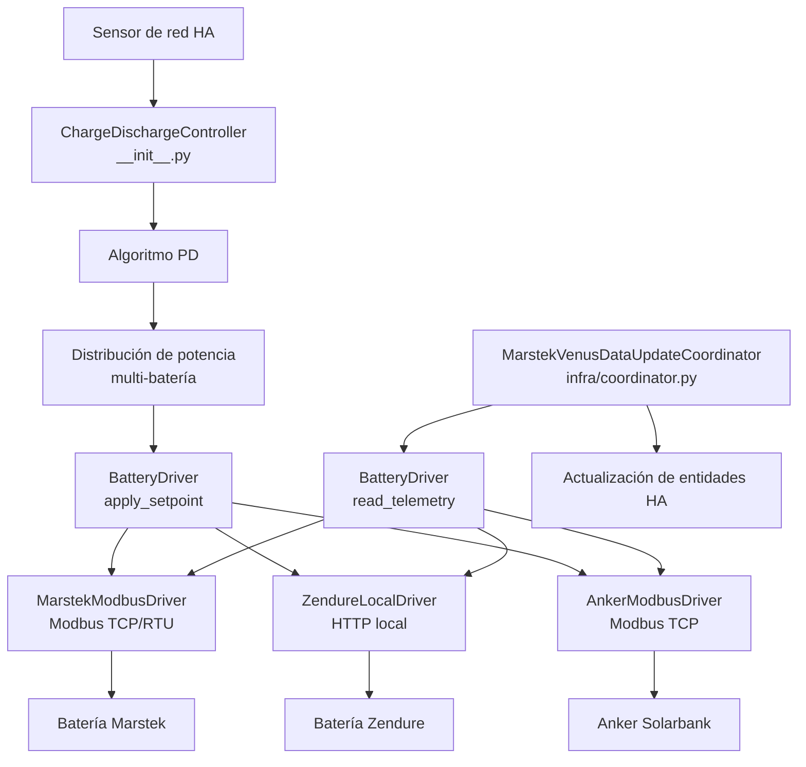

# Arquitectura

## Componentes principales



El bucle de control y el coordinador nunca hablan con el hardware directamente:
cada lectura y escritura pasa por un **`BatteryDriver`** agnóstico de marca (ver
[Drivers de hardware](#drivers-de-hardware) más abajo). Esto es lo que hace
multi-marca a la integración — añadir una marca de batería es escribir un driver
nuevo, no editar la lógica de control.

## Módulos

La raíz de la integración guarda solo los archivos de plataforma de Home
Assistant (`sensor.py`, `number.py`, …) y el controlador. Todo lo demás vive en
subpaquetes por responsabilidad.

| Archivo | Clase principal | Responsabilidad |
|---|---|---|
| `__init__.py` | `ChargeDischargeController` | Bucle de control principal (dirigido por eventos del sensor de red + watchdog de 2 s), algoritmo PD, distribución multi-batería |
| `config_flow.py` | — | Asistente de configuración multi-paso en HA UI (selección de marca, baterías, funciones) |
| **`drivers/`** | `BatteryDriver` | Abstracción de hardware agnóstica de marca — ver abajo |
| `drivers/base.py` | `BatteryDriver`, `DriverCapabilities` | El contrato del driver y el dataclass de rasgos estáticos |
| `drivers/marstek.py` | `MarstekModbusDriver` | Marstek Venus (v2/v3/vA/vD) por Modbus TCP / RTU |
| `drivers/zendure.py` | `ZendureLocalDriver` | Zendure SolarFlow por HTTP local |
| `drivers/anker.py` | `AnkerModbusDriver` | Anker SOLIX Solarbank Max AC por Modbus TCP (lecturas FC03/FC04) |
| `infra/coordinator.py` | `MarstekVenusDataUpdateCoordinator` | Polling periódico de telemetría (vía el driver), actualización de entidades |
| `infra/modbus_client.py` | `MarstekModbusClient` | Transporte Modbus TCP/RTU asíncrono con pymodbus, reintentos con backoff |
| `infra/anker_modbus_client.py` | `AnkerModbusClient` | Modbus TCP asíncrono para Anker (lecturas FC03/FC04, escrituras FC06/FC16) |
| `infra/external_loads.py` | — | Ajuste por dispositivos excluidos y reparto del excedente solar |
| `infra/alarm_notifier.py` | `AlarmNotifier` | Detección de cambios de bits de alarma/fallo y formateo de notificaciones persistentes de HA |
| `infra/entity_naming.py` | — | IDs de entidad basados en translation-key y migraciones del registro |
| `const/` | — | Definiciones de todos los registros Modbus y entidades (divididas por versión de batería) |
| `pricing/engine.py` | — | Carga predictiva: precio dinámico, franja horaria, precio en tiempo real, SOC garantizado |
| `control/power_distribution.py` | — | Reparte el setpoint del sistema entre las baterías activas |
| `control/charge_delay.py` | — | Retraso de carga solar |
| `control/max_soc_charge.py` | — | Reducción por voltaje al 100 % / protección de tope de carga |
| `control/weekly_full_charge.py` | `WeeklyFullChargeManager` | Estado de carga semanal completa, persistencia y orquestación de escritura de registros |
| `control/active_balance_mode.py` | — | Medición de balance activo de celdas |
| `tracking/consumption_tracker.py` | `ConsumptionTracker` | Historial de consumo, acumuladores de energía diaria, detección de tiempos solares, backfill del recorder, captura diaria |
| `tracking/balance_monitor.py` | `CellBalanceMonitor` | Medición del spread de tensión de celdas tras la carga completa e historial de salud |
| `tracking/non_responsive_tracker.py` | `NonResponsiveTracker` | Detección de baterías sin respuesta y ventanas de exclusión de 5 minutos |
| `tracking/hourly_balance.py` | — | Contabilidad de balance neto horario (España RD 244/2019) |
| `sensors/aggregate_sensors.py` | — | Sensores agregados del sistema (suma de todas las baterías) |
| `sensors/calculated_sensors.py` | — | Sensores derivados (ciclos, eficiencia, energía sintética, estimaciones) |

## Drivers de hardware

Un **driver** posee toda la E/S de hardware específica de marca — transporte,
ciclo de vida de la conexión, decodificación de telemetría y comandos de
control — detrás de una sola interfaz,
[`drivers/base.py`](https://github.com/ffunes/omnibattery/blob/main/custom_components/omnibattery/drivers/base.py)`::BatteryDriver`.
El coordinador y el bucle de control hablan solo con esa interfaz, así que nunca
ramifican por marca o versión de firmware.

El contrato es deliberadamente **semántico, no con forma de registro**. Expone
dos operaciones — «dame una instantánea de telemetría» y «entrega esta potencia
neta» — de modo que una batería de registros/Modbus (Marstek) y una de
propiedades/HTTP (Zendure) encajan ambas detrás de él sin que direcciones de
registro ni rutas HTTP se filtren a la capa de control.

### Qué aporta un driver

| Superficie | Método / propiedad | Propósito |
|---|---|---|
| Identidad | `capabilities`, `model_label` | Rasgos estáticos del hardware (ver abajo) y una etiqueta de display |
| Conexión | `connect()`, `close()`, `connected` | Ciclo de vida del transporte (posee el slot TCP único de v3, etc.) |
| Lectura | `read_telemetry(keys)`, `read_groups` | Última telemetría como dict plano `{clave_lógica: valor}`; `read_groups` permite al coordinador programar el polling por bloque de registros |
| Escritura | `apply_setpoint(net_power_w, …)` | Comanda una única potencia neta con signo (+carga / −descarga); el driver la traduce a su propio formato de cable |
| Escritura | `write_control(key, value)` | Ruta genérica de escritura para las entidades number/select/switch de usuario |

`apply_setpoint` devuelve un `SetpointResult` que lleva la potencia aplicada, si
la escritura se confirmó por readback, la potencia entregada medida y un eco del
estado nativo de la marca que el coordinador fusiona en `coordinator.data`.

### Las capacidades reemplazan a los checks de versión

Cada driver reporta un `DriverCapabilities` inmutable una vez; los llamadores lo
consultan en lugar de codificar `if battery_version in (...)`. Las capas de
control y entidades lo leen desde `coordinator.capabilities`:

| Capacidad | Significado |
|---|---|
| `hardware_soc_cutoff` | El hardware aplica el corte min/max de SOC por sí mismo (v2); si no, lo hace la capa de control por software |
| `has_force_mode` | El hardware tiene un comando de modo forzado/carga/descarga distinto |
| `push_telemetry` | La telemetría llega por push en vez de polling |
| `max_charge_power_w` / `max_discharge_power_w` | Envolvente de potencia que acepta el hardware |
| `has_mppt_pv` | Entradas PV de acoplamiento DC / MPPT presentes (Venus A/D) |
| `has_alarm_registers` | Expone estado de alarma/fallo (solo Marstek v2) |
| `has_rs485_control` | El modo de control externo RS485/Modbus se puede conmutar |
| `has_energy_counters` | Reporta energía acumulada + capacidad nominal; cuando es falso la integración sintetiza la energía a partir de la potencia y toma la capacidad de una entidad de usuario (Zendure) |
| `setpoint_confirm_reliable` | Un readback refleja de forma fiable el comando recién escrito en el ciclo de confirmación |
| `actuator_latency_s` | Tiempo de peor caso para que un setpoint se aplique y aparezca en la telemetría — gobierna el ritmo del bucle por driver |

El coordinador selecciona el driver según la marca configurada
([`infra/coordinator.py`](https://github.com/ffunes/omnibattery/blob/main/custom_components/omnibattery/infra/coordinator.py)):
`zendure` → `ZendureLocalDriver`, `anker` → `AnkerModbusDriver`, `esphome` → `EsphomeEntityDriver`, en otro caso `MarstekModbusDriver`. El driver
también posee las listas de definiciones de registro/entidad de su versión, que
las plataformas leen en lugar de ramificar por la cadena de versión.

## Flujo de datos

```
Sensor de red → Controlador (PD) → Distribución de potencia → driver.apply_setpoint → Baterías
                      ↑
Coordinador → driver.read_telemetry → Actualización de entidades
```

## Intervalos de polling

| Intervalo | Período | Registros |
|---|---|---|
| `high` | 2 s | Potencia, SOC |
| `medium` | 5 s | Tensión, corriente, temperatura |
| `low` | 30 s | Energía acumulada, alarmas |
| `very_low` | 600 s | Info de dispositivo, firmware |
